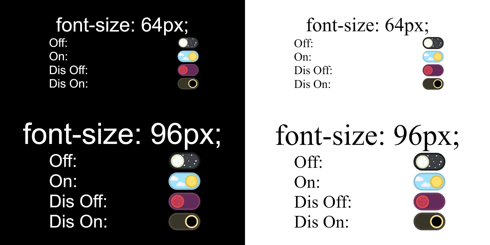

# Night-Day Inputs



## Usage

```
<head>
    <link rel="stylesheet" href="https://rawgit.com/g0od1k/night-day-input/build/check.min.css" />
</head>
<body>
    <input type="checkbox" class="night-day">
</body>
```

## Available Input Types

- [x] Checkbox
- [ ] Switch
- [ ] Radio
- [ ] Text
